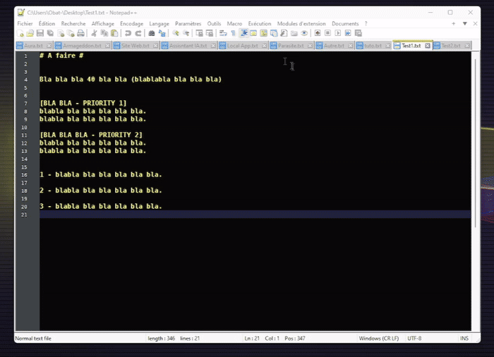
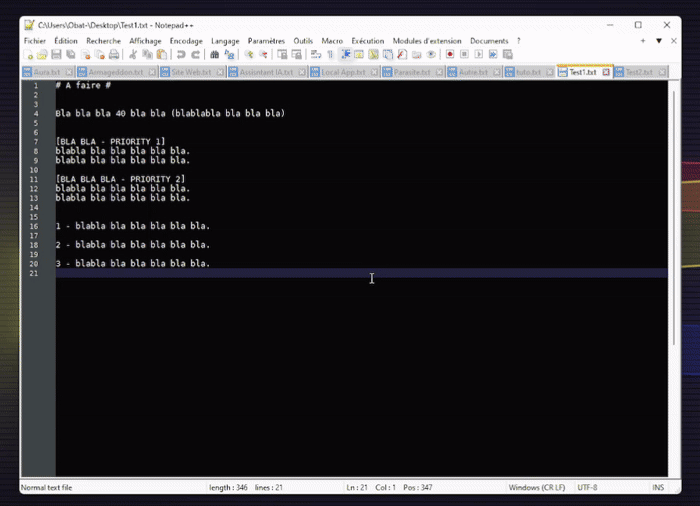

# AutoLangSwitcher

**AutoLangSwitcher** is a Notepad++ plugin that automatically applies your preferred language or User Defined Language (UDL) to new documents and plain-text files, while leaving files with known extensions untouched.

Tested with **Notepad++ 8.6**.

## Direct Downloads

- [AutoLangSwitcher.dll](https://github.com/Mister-Obat/npp-auto-language-switcher/raw/main/release/AutoLangSwitcher.dll)
- [Langue-Perso-1.xml](https://github.com/Mister-Obat/npp-auto-language-switcher/raw/main/release/Langue-Perso-1.xml) - personal UDL preset shared by Mister Obat as a ready-to-import example

## Visual Guide

Import the shared UDL, apply the global visual configuration, then save and use it in Notepad++:



Select your custom language on a document, then apply it as the default language through the plugin:



## English

### Features

- **Automatic language switching**: applies your preferred language to new and opened plain-text files immediately.
- **Safe for code files**: ignores known extensions such as `.cpp`, `.py`, `.xml`, or `.json`.
- **UDL support**: works with Notepad++ User Defined Languages.
- **Smart state tracking**: respects manual language changes per tab.
- **Simple setup**: save the current language from the plugin menu.

### Plugin Installation

1. Download [AutoLangSwitcher.dll](https://github.com/Mister-Obat/npp-auto-language-switcher/raw/main/release/AutoLangSwitcher.dll).
2. Open your Notepad++ plugins directory, usually `C:\Program Files\Notepad++\plugins`.
3. Create a folder named `AutoLangSwitcher`.
4. Copy `AutoLangSwitcher.dll` into that folder.
5. Restart Notepad++.

### Fresh Notepad++ Setup With The Shared UDL

1. Start from a clean **Notepad++ 8.6** installation. The shared preset was prepared from the author's personal setup on Notepad++ 8.6.
2. Open `Language > User Defined Language > Define your language...`.
3. Click `Import` and select [Langue-Perso-1.xml](https://github.com/Mister-Obat/npp-auto-language-switcher/raw/main/release/Langue-Perso-1.xml).
4. Select the imported language in the drop-down list, then use `Save As` if you want to rename it for your own setup.
5. Install the plugin DLL in the Notepad++ plugins folder as described above.
6. Restart Notepad++, choose your UDL on a document, then go to `Plugins > AutoLangSwitcher > Set Current as Default`.
7. New documents and plain-text files handled by the plugin will now open with that UDL by default.

### Usage

Open **Plugins > AutoLangSwitcher**:

- **Set Current as Default**: saves the active document language as the global default.
- **Disable / Reset Config**: disables automatic switching and clears the saved choice.
- **About**: shows version information.

### Build from Source

1. Open an **x64 Native Tools Command Prompt for VS**.
2. Go to the `AutoLangSwitcher` directory.
3. Run:

```cmd
build.bat
```

4. The build output is generated in `release/`.

## Francais

**AutoLangSwitcher** est un plugin Notepad++ qui applique automatiquement votre langage prefere, y compris un UDL, aux nouveaux documents et aux fichiers texte simples, tout en laissant intacts les fichiers ayant deja une extension connue.

Compatible avec **Notepad++ 8.6**.

### Fonctionnalites

- **Bascule automatique** : applique instantanement le langage choisi aux nouveaux documents et aux fichiers texte ouverts.
- **Securise pour le code** : ignore les extensions connues comme `.cpp`, `.py`, `.xml` ou `.json`.
- **Compatible UDL** : fonctionne avec les User Defined Languages de Notepad++.
- **Suivi intelligent** : respecte les changements manuels de langage par onglet.
- **Configuration rapide** : permet de definir le langage courant comme defaut depuis le menu du plugin.

### Installation Du Plugin

1. Telechargez [AutoLangSwitcher.dll](https://github.com/Mister-Obat/npp-auto-language-switcher/raw/main/release/AutoLangSwitcher.dll).
2. Ouvrez le dossier des plugins de Notepad++, en general `C:\Program Files\Notepad++\plugins`.
3. Creez un dossier nomme `AutoLangSwitcher`.
4. Copiez `AutoLangSwitcher.dll` dans ce dossier.
5. Redemarrez Notepad++.

### Mise En Place Complete Depuis Une Installation Propre

1. Partez d'une installation propre de **Notepad++ 8.6**. Le preset partage provient du setup personnel de l'auteur sous Notepad++ 8.6.
2. Ouvrez `Langage > Langage defini par l'utilisateur > Definir votre langage...`.
3. Cliquez sur `Importer` puis selectionnez [Langue-Perso-1.xml](https://github.com/Mister-Obat/npp-auto-language-switcher/raw/main/release/Langue-Perso-1.xml).
4. Choisissez ensuite ce langage dans la liste deroulante, puis utilisez `Enregistrer sous` si vous voulez le renommer.
5. Installez ensuite `AutoLangSwitcher.dll` dans le dossier des plugins comme indique plus haut.
6. Redemarrez Notepad++, choisissez votre langage user sur un document, puis ouvrez `Plugins > AutoLangSwitcher > Set Current as Default`.
7. Les nouveaux documents et les fichiers texte geres par le plugin s'ouvriront alors avec ce langage par defaut.

Le GIF `Config Langue perso` montre l'import du langage perso, son application, et la configuration globale necessaire pour faire apparaitre correctement ses effets visuels.

Le GIF `Appliquer Plugin` montre la selection d'une langue perso deja disponible, puis son application via `Plugins > AutoLangSwitcher > Set Current as Default`.

### Utilisation

Menu **Plugins > AutoLangSwitcher** :

- **Set Current as Default** : definit le langage du document actif comme defaut global.
- **Disable / Reset Config** : desactive la bascule automatique et efface le choix sauvegarde.
- **About** : affiche les informations de version.

### Compilation

1. Ouvrez **x64 Native Tools Command Prompt for VS**.
2. Placez-vous dans le dossier `AutoLangSwitcher`.
3. Lancez :

```cmd
build.bat
```

4. Le resultat est genere dans `release/`.

---

## 📜 License
Ce projet est distribué sous licence AGPL-3.0.

---
*Codé 100% par des IA, supervisé à l'arrache par Obat 😏*
